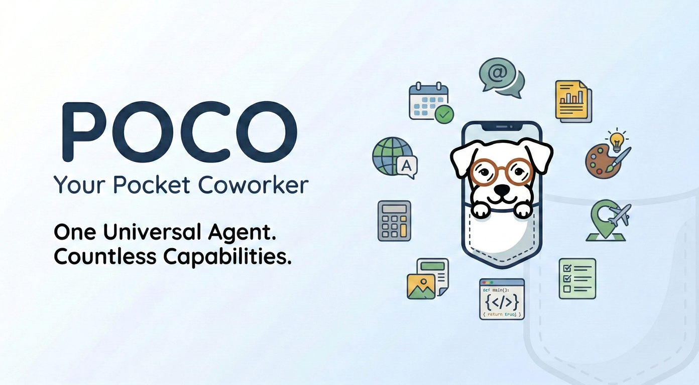

<div align="center">



# Poco: Your Pocket Coworker

更安全、更漂亮、更易用的 OpenClaw 替代方案

[](https://opensource.org/licenses/MIT)
[](https://www.docker.com/)
[](https://www.python.org/downloads/)
[](https://nextjs.org/)
[](https://fastapi.tiangolo.com/)
[](https://deepwiki.com/poco-ai/poco-agent)

[English](README.md) | [简体中文](README_zh.md)

</div>

## 核心功能

- **安全沙箱**：任务在隔离容器中运行 - 可自由安装依赖或修改文件，不影响宿主环境
- **精美界面 & 移动端支持**：提供美观的 Web 界面和输出预览，随时随地用手机操控你的 Agent
- **零配置开箱即用**：无需复杂的环境搭建 - 一键 Docker 启动，拥有完整运行环境
- **完整能力 & MCP/Skills 扩展**：完整复刻 Claude Code 原生功能（Slash Commands、Plan Mode、AskQuestion），支持 MCP 协议或自定义 Skills 实现无限扩展
- **异步 & 定时任务**：支持后台执行和定时触发 - 即使关闭浏览器，Agent 也在云端持续工作
- **更多功能**：内置**浏览器**实现自主网络研究、**GitHub 仓库连接**支持，还有更多强大功能等你发现！

## 快速开始

运行交互式安装脚本，自动生成配置并启动服务：

```bash
./scripts/quickstart.sh
```

启动完成后访问：`http://localhost:3000`

详细的部署文档和问题排查，请参考 [部署指南](./docs/zh/README.md)。

## Star 趋势

[](https://www.star-history.com/#poco-ai/poco-agent&type=date&legend=top-left)
