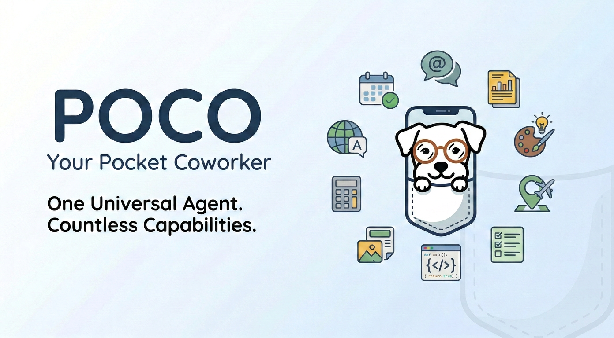

<div align="center">



# Poco: Your Pocket Coworker

更安全、更漂亮、更易用的 OpenClaw 替代方案

[](https://opensource.org/licenses/MIT)
[](https://www.docker.com/)
[](https://www.python.org/downloads/)
[](https://nextjs.org/)
[](https://fastapi.tiangolo.com/)
[](https://docs.poco-ai.com/)
[](https://deepwiki.com/poco-ai/poco-agent)

[English](README.md) | [简体中文](README_zh.md)

</div>

## 核心功能

- **安全沙箱（Secure Sandbox）**
  所有任务运行在隔离容器中，可自由安装依赖、修改文件与执行命令，**不影响宿主环境**。
  - **本地目录挂载** — 将宿主机目录挂载到沙箱中，让 agent 直接操作你的项目文件（仅自托管模式）
- **不仅是 ChatBot**
  - 支持**计划模式（Plan Mode）**、对话排队、对话终止等能力
  - **项目管理**：更好地组织与切换不同任务/上下文
  - **文件上传**：支持多种文件格式输入与处理
- **精美而高效的界面**
  - **产物界面**：支持多种格式渲染与预览（HTML、PDF、Markdown、图片、视频、Xmind、Excalidraw、Drawio 等）
  - **回放界面**：可回看命令输入输出、浏览器操作与 Skills/MCP 调用记录
  - 支持**明暗模式**
- **Agentic 体验**
  - 完整复刻 **Claude Code** 原生体验：Slash Commands、Plan Mode、AskQuestion
  - 支持 **MCP 协议** 与自定义 Skills：易导入、可无限扩展
  - 内置**浏览器**：支持自主网络研究与信息整合
  - 支持 **GitHub 仓库连接**：代码检索、阅读与编辑
  - 支持**后台执行与定时任务**：即使关闭浏览器，Agent 也能在云端持续运行
- **交互重构（多端与消息驱动）**
  - **移动端支持**：随时随地操控你的 Agent
  - **IM 支持**：后端内嵌的钉钉 / 飞书 / Telegram 消息传递，支持推送与事件订阅
  - **个人部署**：一键 Docker 启动，获得完整运行环境
  - **云端订阅**：敬请期待
  - **多语言支持**
- **智能记忆（Smart Memory）**
  Powered by **mem0**：Agent 能记住你的偏好、项目上下文与历史交互，让协作越来越顺手。
- **更多能力等你发现！**

## 快速开始

运行交互式安装脚本，自动生成配置并启动服务：

```bash
./scripts/quickstart.sh
```

启动完成后访问：`http://localhost:3000`

详细的部署文档和问题排查，请参考 [部署指南](https://docs.poco-ai.com/zh/deployment)。

## Star History

[](https://www.star-history.com/#poco-ai/poco-agent&type=date&legend=top-left)
